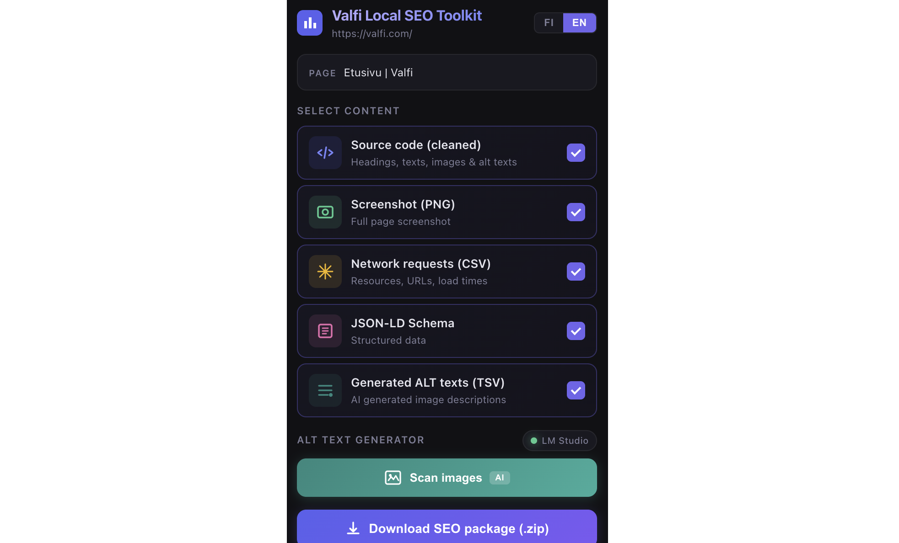

# Valfi Local SEO Toolkit

Valfi Local SEO Toolkit is a powerful Chrome extension designed to automate and streamline technical SEO analysis and accessibility workflows. It extracts essential page data, takes full-page screenshots, and leverages local AI (via LM Studio) to automatically generate SEO-optimized ALT texts for missing images.


## Features

The toolkit can bundle multiple reports into a single, downloadable `.zip` package:

1. **Source Code (Cleaned)**: Extracts only the most relevant SEO elements (headings, text, images, links, meta tags) while stripping out heavy CSS, inline scripts, and noise.
2. **Full Page Screenshot**: Captures a full-page PNG screenshot of the current viewport and beyond using Chrome's Debugger API.
3. **Network Requests**: Records all network activity (resources, types, sizes, load times) and exports them as a CSV.
4. **JSON-LD Schema**: Collects all structured data (`application/ld+json`) found on the page into a clean JSON file.
5. **AI ALT Text Generator**: Scans the page for images missing ALT text and uses a local Vision AI model to batch-generate SEO-optimized descriptions. The generated texts can be copied individually or downloaded as a TSV file.

Supports bilingual UI: **Finnish** and **English**.

## Prerequisites for AI Features

To use the AI ALT Text Generator, you need to run a local language model server.

1. **LM Studio**: Download and install [LM Studio](https://lmstudio.ai/).
2. **Vision Model**: You need an LLM capable of image analysis (Vision).
   * Recommended model: `gemma-4-26b-a4b-it-mlx` or similar (e.g., LLaVA, Qwen-VL, or Gemma-2-Vision).
   * Load the model in LM Studio.
3. **Local Server**:
   * Navigate to the "Local Server" tab (`<->` icon) in LM Studio.
   * Make sure the port is set to `1234`.
   * Click the green **Start Server** button.

## Installation

1. Clone or download this repository.
2. Open Google Chrome (or Microsoft Edge) and navigate to `chrome://extensions/`.
3. Enable **Developer mode** in the top right corner.
4. Click **Load unpacked** and select the directory containing this extension (`manifest.json` folder).

## Configuration

By default, the extension expects LM Studio to be running on your local machine (`http://localhost:1234`) with a specific Gemma model. 

If you are using a different model name or running the server on a different IP/port, you need to update the configuration in `background.js`:

```javascript
// background.js (Lines 7-8)

// Change this if your LM Studio server runs on a different host or port:
const LM_STUDIO_BASE = 'http://localhost:1234'; 

// IMPORTANT: Change this to match the EXACT model name you loaded in LM Studio:
const LM_MODEL = 'gemma-4-26b-a4b-it-mlx'; 
```

> **Note**: If you change the port or the host IP, make sure to also update the `host_permissions` section in `manifest.json` to allow the extension to communicate with your new URL.

## How to use

1. Navigate to the webpage you want to analyze.
2. Click the Valfi Local SEO Toolkit icon in your Chrome toolbar.
3. **For Data Extraction**: Check the boxes for the data you want to extract and click "Download SEO package (.zip)".
4. **For ALT Texts**:
   * Click **Scan images** to find all images missing ALT text.
   * Select the images you want to process.
   * Click **Generate ALT texts**. The extension will communicate with your local LM Studio instance to analyze the images.
   * Check "Generated ALT texts (TSV)" before downloading the package to export the results.

## Privacy & Security

This extension runs completely locally.
* Your page data is never sent to external APIs (unless you modify the code to do so).
* AI generations are handled completely offline by your local LM Studio instance, ensuring full data privacy.

<p align="center">
  
</p>
